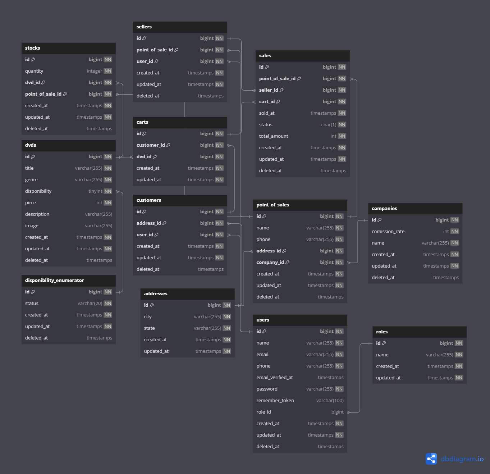
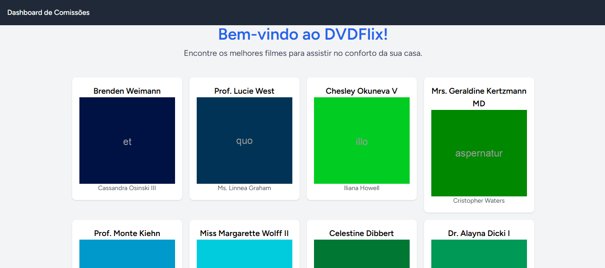
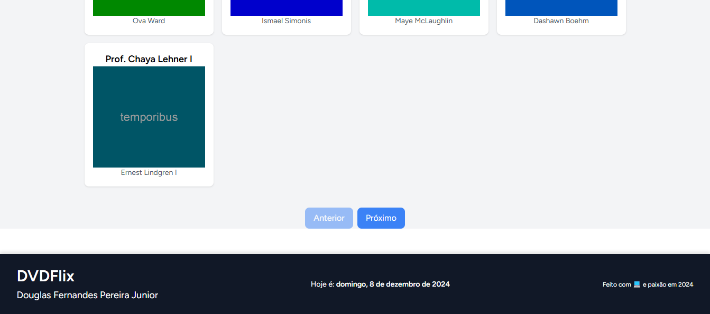
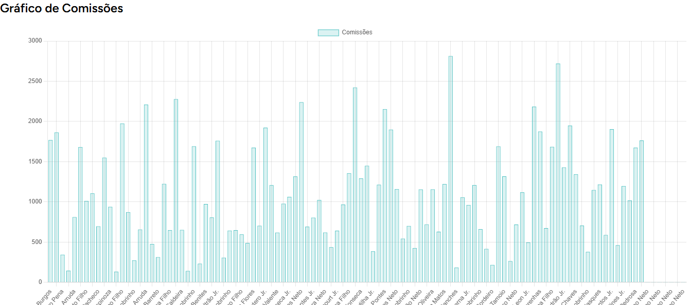

# DVDFLix

# Wiki
[Página Wiki](https://github.com/douglasfdev/rent_a_dvd/wiki)

Este projeto é destinado a aplicação para alugueis de DVD.

# Serviço Backend

* [Configurando Ambiente com Docker](#configurando-ambiente-de-desenvolvimento)
* * [Filas](#filas)
* * [Cron Tasks](#scheduler--cron)
-----
* [Configurando Localmente](#para-ambiente-local-basta-ter-o-php-na-versão-82-ou-acima-também-precisa-ter-redis-e-mysql-instalado-na-máquina)
* * [Filas](#filas-1)
* * [Cron Tasks](#scheduler--cron-1)
-----
* [Postman](#postman)
* [Diagrama do Banco de Dados](#diagrama-do-banco-de-dados)

## Configurando ambiente de desenvolvimento

## Copie e edite(opcional) o arquivo .env
Linux: *`cp env.example .env`*
Windows: *`Copy-Item .\.env.example .\.env`*

## Install docker & docker-compose
https://docs.docker.com/engine/install/

https://docs.docker.com/compose/install/

## Adicionar permissões para o docker
```
sudo usermod -aG docker ${USER}
sudo su - ${USER}
```

## Rodar o docker-compose
*`docker-compose up -d`*

## Aguardar o container da aplicação subir por completo para dar seguimento as dependências

## Gerar uma secret key
*`docker-compose exec app sudo php artisan key:generate`*

## Rodar as migrations com as seeds
*`docker-compose exec app php artisan migrate:fresh --seed`*

### Servidor
Não é necessário executar o comando *`php artisan serve`*, servidor já está com Nginx para expormos a API como serviço web
Serviço estará rodando na URL local: *`http://localhost:8989/`*

## Documentação API
[Página de documentação da API](http://localhost:8989/docs/api#/)

### Filas
As filas estão sendo implementadas com Redis.
Para consumir as filas basta rodar o comando *`docker-compose exec app php artisan queue:work redis`*

### Scheduler / Cron

Para rodar os Jobs do Crontask basta rodar o comando
*`docker-compose exec app php artisan schedule:run`*
ou rodar o worker para lançar o cron task a cada minuto caso tenha um scheduler novo.
*`docker-compose exec app php artisan schedule:work`*

--------

# Para ambiente local basta ter o PHP na versão 8.2 ou acima, também precisa ter Redis e MySQL instalado na máquina

## Rodar o composer
*`composer install`*

## Gerar uma secret key
*`php artisan key:generate`*

## Rodar as migrations com as seeds
Se atentar ao .env DB_HOST precisa estar localhost (127.0.0.1) ao invés de rental-dvd-db
*`php artisan migrate:fresh --seed`*

## Rodar o projeto
*`php artisan serve`*
Serviço estará rodando na URL local: *`http://0.0.0.0:8000/`* ou *`http://localhost:8000`*

### Filas
Se atentar ao .env
REDIS_HOST precisa estar localhost (127.0.0.1) ao invés de rental-dvd-db
Após configurar o Redis, basta rodar o comando *`php artisan queue:work redis`*

### Scheduler / Cron
Para rodar os Jobs do Crontask basta rodar o comando
*`php artisan schedule:run`*
ou rodar o worker para lançar o cron task a cada minuto caso tenha um scheduler novo.
*`php artisan schedule:work`*

---------

# Postman
[Collection](assets/DVDFlix.postman_collection.json)

# Diagrama do Banco de Dados
[Documentação](https://dbdocs.io/douglas.fernandes91/Rent_a_Dvd)

[DiagramaOnline](https://dbdiagram.io/d/6754fbd0e9daa85aca009b5d)



# Serviço Frontend




### Tela principal
Basta rodar a aplicação com Docker: [ref](#rodar-o-docker-compose) e visitar a página:
*`http://localhost:8989/`*

Caso esteja rodando [localmente](#configuração-local) o serviço frontend estará rodando no endereço:
*`http://localhost:8000/`*

### Configuração local
Ter o node instalado na versão 20+

Rodar os comandos:
```
npm i
npm run build
npm run dev
```
